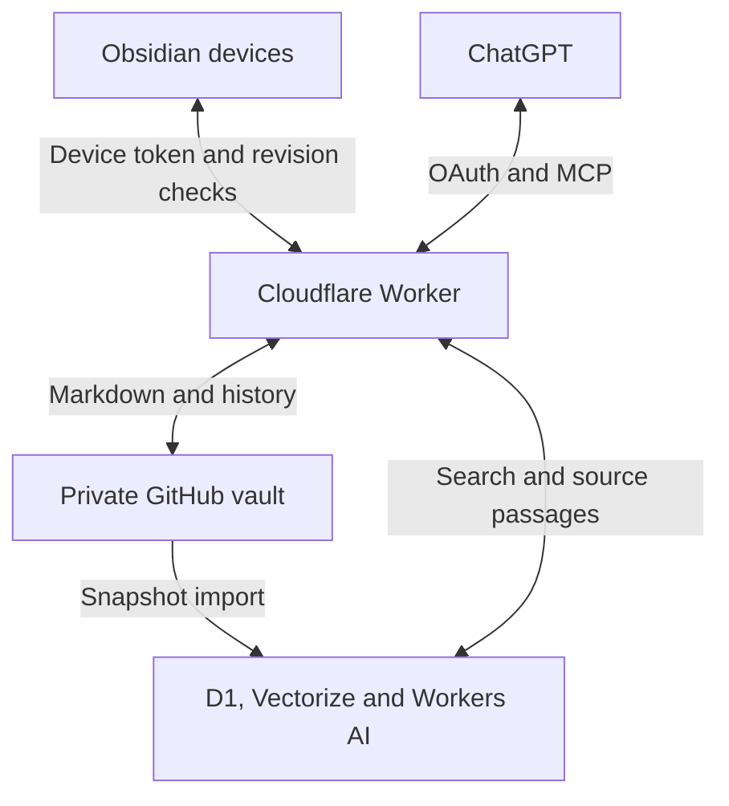

# Obsidian Semantic Engine

Search your Obsidian notes by meaning from ChatGPT, follow their links and read the current source. Keep Markdown in a **private GitHub repository**, with a search mirror on your Cloudflare account.

This repository contains an Obsidian desktop/mobile plugin, a Cloudflare Worker, an OAuth-protected MCP server, deployment scripts and automated tests. It is an independent plugin, not an Obsidian or OpenAI product.

**Version 0.1.0:** automated tests and a Cloudflare deployment dry run are available. Production activation requires Cloudflare authentication, a private notes repository and a ChatGPT connection. Native Obsidian device testing and a real ChatGPT account connection are separate acceptance checks. See [verification](docs/VERIFICATION.md).

## Start here

- **Anyone receiving a configured server:** [Install in Obsidian](docs/INSTALL.md), then [Connect ChatGPT](docs/CHATGPT.md).
- **Deploy your own server:** [Cloudflare setup](docs/DEPLOY.md).
- **Download:** [GitHub releases](https://github.com/krshirkoohi/obsidian-semantic-engine/releases), including the three Obsidian plugin files, an installation ZIP and checksums.
- **Develop:** `npm ci && npm run check && npm run deploy -- --dry-run` using Node.js 24.



The public code repository and each person's private notes repository are separate. GitHub holds shared note versions. Obsidian holds local working copies. Cloudflare holds a derived index.

## Capabilities

| Feature | Behaviour |
|---|---|
| Sync | Markdown creates, edits, deletes and file/folder renames; local changes survive offline periods. |
| Conflicts | Keeps the local note and saves the remote copy. Does not guess which edit wins. |
| Search | Workers AI embeddings plus D1 FTS5, combined by reciprocal rank fusion. |
| Structure | YAML properties, tags, aliases, headings, source lines, wikilinks, Markdown links and backlinks. |
| Dates | Explicit `date: YYYY-MM-DD` or daily-note filename, not file modification time. |
| Citations | Immutable GitHub commit URLs and native Obsidian links. |
| ChatGPT | OAuth 2.1, PKCE, consent, expiring tokens and refresh. Read access by default. |
| Optional writes | Deployment setting plus explicit consent; every change checks the GitHub revision. |
| Recovery | Serial mirror refreshes, bounded batches, retry alarms, a five-minute catch-up schedule and stale-vector filtering. |

## Boundaries

- **Markdown only.** Attachments, Canvas files, hidden folders and application settings do not sync.
- Mobile sync runs while Obsidian is open. Cloudflare remains available when devices sleep.
- Use one sync system for these notes. Other services rewriting the same files can cause conflicts.
- An empty new device downloads notes; it never requests deletion of the remote vault.
- Deletions made while this plugin is closed are not observed and are restored from GitHub. Delete again with the plugin active to propagate them.
- Search is eventually consistent. `get_note` reads the current source; `sync_status` reports indexed coverage.
- Protective limits are 5,000 notes and 256 KiB per note. These are limits, not performance guarantees. Provider quotas still apply.
- Embeddings use the English `@cf/baai/bge-small-en-v1.5` model, 384 dimensions. Unicode is preserved; lexical search also supports it.

## Build and verify

```bash
npm ci
npm run check
npm run deploy -- --dry-run
npm run package
```

Tests cover parsing, cross-device sync and workerd integration. GitHub and AI/Vectorize use controlled fixtures; D1, KV, OAuth, Durable Objects and MCP run in Cloudflare's local runtime. The official MCP client checks the protocol. `npm run smoke -- --write` checks a deployed service with a temporary, test-only note.

The plugin uses Obsidian's vault API and `requestUrl`. It does not use Node.js, Electron, shell commands or a local server. See [security](SECURITY.md), [operations](docs/OPERATIONS.md) and [architecture](docs/ARCHITECTURE.md).

The design adapts [Tana Semantic Engine](https://github.com/krshirkoohi/tana-context-mask)'s semantic-plus-graph approach to Markdown and GitHub revisions. This implementation is written for Obsidian and does not call Tana.

Licensed under [MIT](LICENSE).
