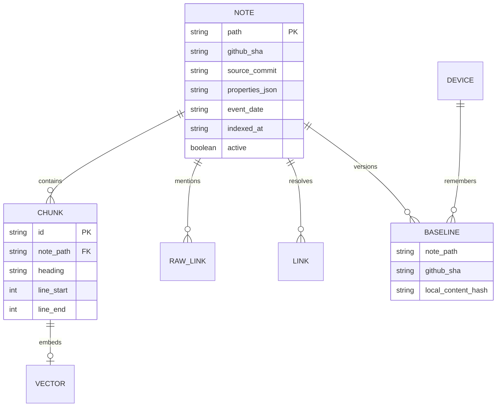

# Architecture and consistency

The plugin sends Markdown through an authenticated Worker. Only the Worker holds the GitHub token. GitHub holds shared revisions and devices keep local working copies. A singleton Durable Object serialises mirror refreshes. A five-minute schedule catches direct GitHub changes and missed refreshes.

Baselines and the device token use Obsidian's per-device local storage. Shared settings contain only the server address and switches. No `.obsidian/` file is uploaded.

## Sync

Compare the last shared baseline with both current copies. A changed copy can replace an unchanged one. Two changed copies produce a conflict. Content equality reconciles an upload whose acknowledgement was lost. GitHub writes use the expected blob SHA, so stale edits fail.

Each completed operation saves its baseline. Failure leaves the previous baseline intact. Failed uploads prevent pending remote deletions in that pass, protecting renames. Downloaded changes check local content again before replacement. Remote deletions use Obsidian's local trash.

## Mirror

Read a GitHub commit, immutable tree and blobs by SHA. Reject truncated inventories. Ignore symlinks, hidden/excluded paths and non-Markdown files. Case-only filename collisions block sync.

Hide changed notes until the replacement is indexed. Chunk IDs hash the path, source revision and position. Upsert vectors, then atomically replace the note and chunks in D1. Hydrate search hits only through active D1 chunks, so stale vectors cannot return stale text. A garbage-collection table retries old vector deletion. Failed embedding keeps the old revision hidden and reports an error.

Batches handle at most eight notes and stop starting new notes after 20 seconds. Remaining work schedules an alarm; an all-error batch waits for the scheduled retry. Vectorize mutations are asynchronous, so completed D1 ingestion can briefly precede semantic visibility. Lexical retrieval remains available for indexed notes.

Keep one D1/Vectorize pair and one coordinator namespace per deployment. Do not point two coordinators at the same stores. Rebuild D1 and Vectorize together if replacing the mirror.

## Retrieval

FTS indexes content, paths, headings and frontmatter. Embeddings include a bounded title/heading/metadata prefix. Reciprocal rank fusion combines candidate lists, followed by note deduplication and filters. Links resolve through paths and unique aliases; ambiguous titles are omitted.

Connectivity does not establish authority or truth. Dates come from explicit frontmatter or daily-note filenames. Renames change note and chunk IDs; Git retains history. Dense text may exceed the embedding model's token window despite the character limit; exact reads and lexical search retain the full source.
